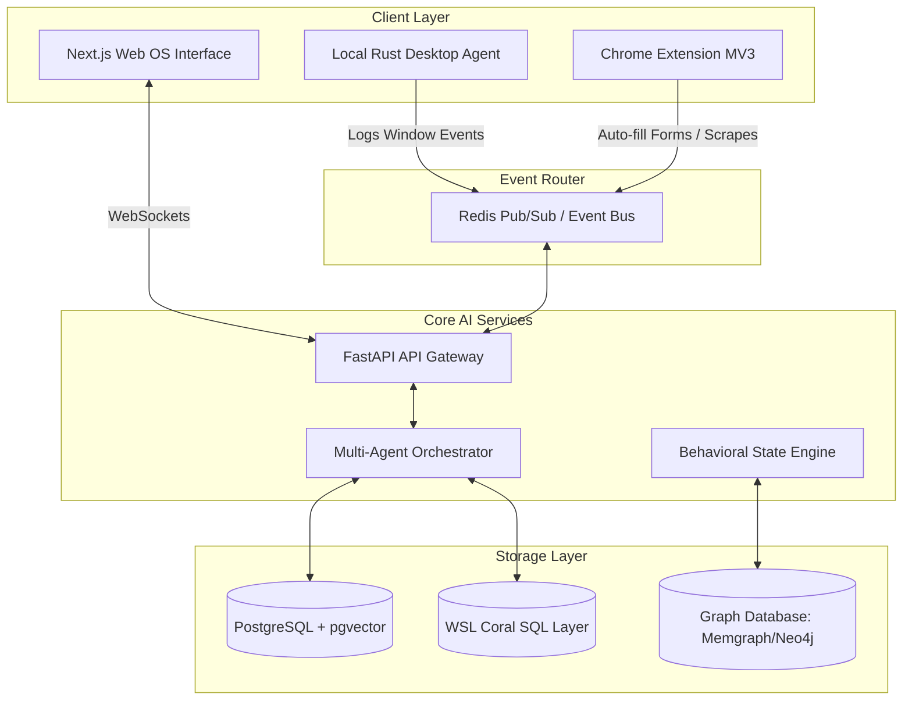
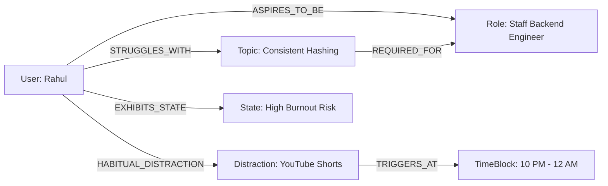
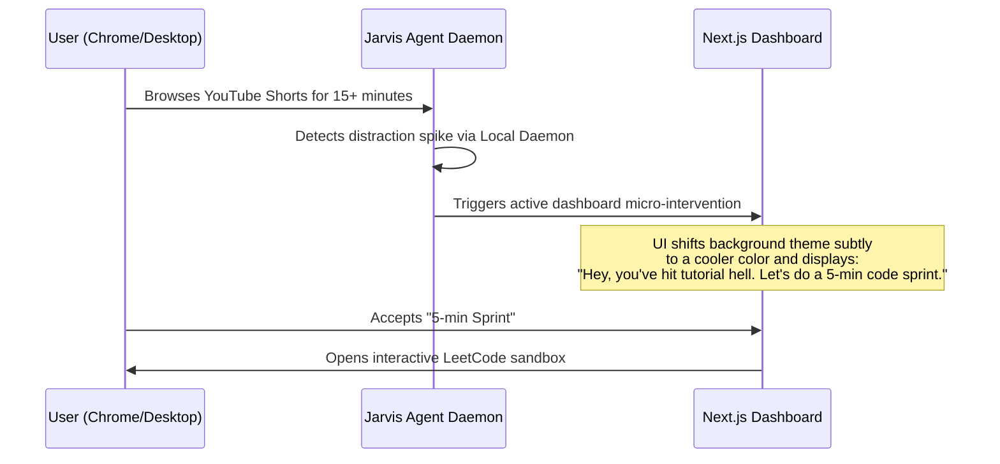
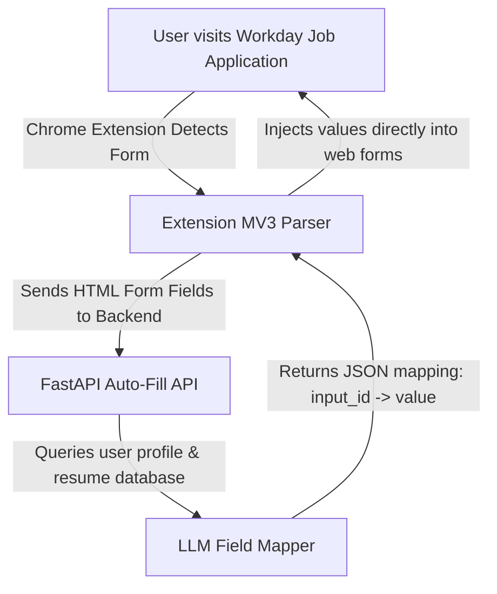

# YC Startup Blueprint: Jarvis OS for Ambitious People
*A next-generation Cognitive Operating System for learning, productivity, and career automation.*

---

## 1. Complete Scalable System Architecture
To handle real-time desktop window tracking, background scrapers, browser extensions, and multiple multi-agent loops without hitting token limits, we transition from a basic FastAPI/Coral setup to an **Event-Driven Micro-Agent Architecture**.

---

## 2. AI Memory Graph & Long-Term Memory System
Instead of a simple chat history string, the user’s identity is modeled as a **Behavioral Memory Graph (Neo4j/Memgraph)** that updates dynamically with every event.

### Graph Schema Nodes & Relationships

### Memory Layers
1. **Episodic Memory**: A vector database index (`pgvector`) containing raw logs of daily activities, searches, and chat logs (searched via semantic query).
2. **Semantic Memory**: The Graph DB mapping how concepts, goals, distraction apps, and job applications link together.
3. **Working Memory**: In-context LLM buffer maintaining current tasks, open browser tabs, and emotional state.

---

## 3. Behavioral Intelligence Engine & Scoring Algorithms
We construct a real-time behavioral classifier that runs daily aggregations over your Coral SQL activity logs.

### A. Focus & Distraction Classification
The engine groups app titles and URLs fetched via Coral into vectors and calculates a **Focus Score ($F$)**:
$$F = \frac{\sum T_{\text{productive}}}{\sum T_{\text{productive}} + \sum T_{\text{distracted}} + 0.5 \sum T_{\text{passive}}} \times 100$$
* *Passive Learning* ($T_{\text{passive}}$): Watching tutorials (tutorial hell) or reading docs without writing code or editing files.

### B. Inconsistency Index ($I$)
Calculated weekly using commits and active study intervals:
$$I = \sigma(\text{Daily Study Minutes}) \times \left(1 + \text{Days Inactive}\right)$$
* High standard deviation ($\sigma$) with high days inactive flags a user who "crams" rather than maintaining consistency.

### C. Burnout Prediction Model
Burnout probability ($P_{\text{burnout}}$) is calculated using:
* Work hours past 10 PM.
* Keystroke speed decay (measured in the local desktop agent).
* Decrease in Focus Score over a rolling 5-day window.
* Chat sentiment analysis (e.g. expressing anxiety or frustration).

---

## 4. Proactive AI Intervention System
When a distraction or burnout metric crosses a critical threshold, the system triggers a **Non-Invasive Intervention Flow** rather than sending annoying push notifications.

---

## 5. Third-Party Intelligence Connectors

### A. GitHub Analysis Engine
Queries `github.commits` and `github.contents` to measure:
* **Active Coding Ratio**: Ratio of code changes (`.ts`, `.py`, `.go`) vs markdown/documentation edits.
* **Architecture Depth**: Complexity of directories, imports, and packages.
* **Moat Indicator**: Identifies if you are building actual projects or merely cloning tutorials.

### B. LinkedIn & Resume Optimization Engine
* Scrapes user-selected jobs using the MV3 Browser Extension.
* **Resume Tailoring Agent**: Runs a localized RAG agent that rewrites your profile and experience to directly fit the target job descriptions without triggering ATS plagiarism detection.

---

## 6. Job Application Automation (The Auto-Fill Agent)
Repeatedly writing details on Workday, Lever, and Greenhouse forms is a massive time sink.

* **Browser Extension Sandbox**: The MV3 extension injects a content script that maps form inputs, asks the local backend to resolve details (e.g. "Work History", "Custom Cover Letter"), and simulates natural typing speeds to bypass anti-bot mechanisms.

---

## 7. event-Driven AI Workflows & Multi-Agent Orchestrator
We use a **CrewAI / LangGraph** multi-agent setup running distinct roles:
1. **The Watcher (Ingestion Agent)**: Continuously parses inbound event streams from your desktop, Chrome extension, and calendar.
2. **The Analyst (Psychologist Agent)**: Runs daily summaries to update the User Memory Graph and calculate cognitive scores.
3. **The Strategist (Career Mentor Agent)**: Periodically crawls matching jobs on Naukri, Indeed, and LinkedIn, ranking them by compatibility.
4. **The Executor (Auto-Apply Agent)**: Generates tailored cover letters, updates resume templates, and logs application tracking.

---

## 8. Startup Moat, Product Strategy & Execution Roadmap

### Startup Moats (Defensibility)
* **Proprietary Memory Graph**: Once a user has 6 months of behavioral, learning, and career data stored, the AI's personalized coaching becomes irreplaceable.
* **Local-First Privacy**: By hosting data locally (queried via Coral in WSL), developers and enterprises will trust this platform with sensitive codebases and resumes, which cloud-only trackers cannot achieve.

### Phase 1: MVP Focus (Weeks 1 - 6) — ✅ PARTIALLY COMPLETE
* ✅ Launch the MV3 Chrome Extension for Auto-Filling Lever and Greenhouse job forms.
* ✅ Integrate the LinkedIn job scraper (basic popup + profile fetch).
* ✅ Build the basic Memory Graph using PostgreSQL + `pgvector`.
* ✅ Chrome Extension v1 — fills name, email, phone, LinkedIn, GitHub, summary.

### Phase 1B: Extended Profile & Full ATS Coverage — ✅ COMPLETE
* ✅ `extended_profile_template.json` — 50+ fields covering ALL ATS questions (address, education, work auth, compensation, behavioral answers, EEO).
* ✅ `content.js` v2.0 — handles `<select>` dropdowns, radio buttons, checkboxes, and 50+ field types.
* ✅ `workday_content.js` — Workday shadow DOM piercing, ARIA radio/checkbox handling, multi-step form MutationObserver.
* ✅ `icims_content.js` — iCIMS iframe + jQuery handler with 500ms delay for slow form loads.
* ✅ `manifest.json` — domain-specific routing: Workday handler → `*.myworkdayjobs.com`, iCIMS handler → `*.icims.com`, universal handler → all other ATS sites.
* ✅ Backend `ProfileUpdate` model — expanded from 9 to 110+ fields with completeness scoring.
* ✅ Backend `/profile` GET — returns `_completeness_pct` and `_missing_fields` list.
* ✅ Backend `/profile` POST — smart merge (preserves existing values, only overwrites if new value provided).
* ✅ `popup.html` + `popup.js` v2.0 — profile completeness % bar, missing field chips, ATS auto-detector (16 platforms), field count after autofill.

### Job Application Sites To Use
* **Tier 1 (High Volume):** LinkedIn Easy Apply, Naukri.com, Indeed, Instahyre, Foundit, Shine
* **ATS Platforms:** Workday (`*.myworkdayjobs.com`), Greenhouse (`boards.greenhouse.io`), Lever (`jobs.lever.co`), Ashby (`jobs.ashby.com`), SmartRecruiters, BambooHR
* **India Startups:** Cutshort, AngelList/Wellfound, Hirist, HackerEarth Jobs
* **Top Direct Pages:** Google Careers, Swiggy, Razorpay, Zepto, CRED, PhonePe, Meesho, BrowserStack

### Phase 2: Behavioral Integration (Weeks 7 - 12)
* Release the Desktop Rust Daemon for background distraction/productivity logging.
* Connect Coral to local search logs and YouTube history.
* Enable Jarvis to proactively suggest code sprints when distraction spikes occur.

### Phase 3: Scaling & AGI Integration (Weeks 13+)
* Integrate multi-agent LangGraph workflow for job application tracking.
* Launch corporate enterprise workspace support (protecting IP while optimizing developer focus).

